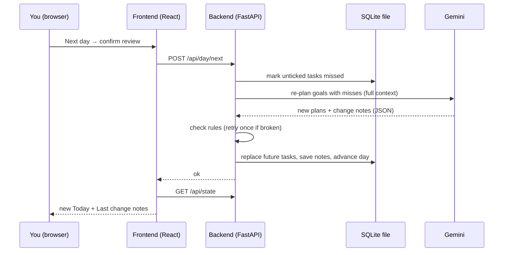

# SysPlanner (working name) — Technical Spec

## How This Works, In Plain Language

SysPlanner is two programs on your laptop that talk to each other, plus one file and one outside service.

- **The backend** is a Python program built with **FastAPI**. It holds all the rules: the 3-goal cap, what counts as missed, when to re-plan. It is the only part that talks to the AI and the only part that reads and writes the data file.
- **The frontend** is the screen you click on, written in **TypeScript with React**, and turned into something the browser can run by **Vite**. It shows the sidebar, Today, the Goal view and the dialogs. It never decides anything; it asks the backend and shows what comes back.
- **The data file** is a **SQLite** database: one file on your laptop (`data/sysplanner.db`). Your weekly hours, goals, breakdowns, every task and every tick live there, so closing the app loses nothing.
- **The AI** is **Gemini**, reached through a small "planner" layer in the backend. Whenever a plan needs to be built or changed, the backend sends Gemini the full picture (your weekly hours, today's date, every goal and its tasks, what you missed) and asks for the answer in a fixed shape. That shape is defined once in Python, so the backend can check the reply before trusting it. The planner layer has a slot for OpenAI too, but only Gemini is built.

The one idea to hold on to: **the AI proposes, the backend checks, the database remembers.** Every AI reply passes code rules (every task has a done criterion, an estimate and a why; nothing goes over your weekly hours; nothing runs past the deadline) before it is saved. If a reply breaks a rule, the backend asks once more, then shows a calm "planning failed, retry" message and changes nothing.

Days are simulated. The app keeps its own "current day" in the database, starting on the real date of your first open, and **Next day** moves it forward by one.

Why this shape and not something bigger: it's single-user and clone-and-run, so there are no accounts, no cloud database and no hosting. The only thing outside your laptop is the AI, because the AI is the product.

## The Core Journey Through the System

PRD ref: `prd.md > The Core Journey`.

1. **First open.** The frontend asks the backend for the whole app state (`GET /api/state`). There are no settings yet, so it shows the weekly-hours step. You type 50; the frontend sends it (`POST /api/settings`); the backend saves it and sets the current day to today's real date.
2. **Add a goal.** You enter "Build 16 products by the end of 2026" and 31 Dec 2026. The frontend sends it (`POST /api/goals`) and shows "Planning…".
3. **Feasibility + system.** The backend checks the cap, then makes one AI call with your weekly hours, the current day, the existing goals and the new goal. Gemini replies with a verdict:
   - **Impossible:** the backend saves nothing and returns the message. The dialog shows it and asks for a new deadline. You submit again, which is a fresh call.
   - **Stretch / comfortable:** the reply also contains the new goal's breakdown and day-by-day plan, plus any rework of existing goals. The backend checks the rules, then in one transaction saves the new goal and applies the rework (replacing existing goals' unticked tasks from today onward and writing their **Last change** notes). The goal appears in the sidebar and its Goal view opens.
4. **More goals.** Steps 2–3 repeat for goals 2 and 3. A 4th gets a plain refusal from the backend (HTTP 409) before any AI call.
5. **Today.** `GET /api/state` returns today's tasks across all goals, labelled by goal. Ticking one sends `POST /api/tasks/{id}/toggle`; the backend saves it and the frontend refreshes state.
6. **Next day → review.** The frontend checks today's tasks for unticked ones. If there are any, it opens the review dialog listing them; ticks there use the same toggle call. If all are ticked, it skips the review.
7. **Re-plan.** Confirming sends `POST /api/day/next`. The backend marks today's unticked tasks as **missed**, then makes one AI call covering only the goals with misses, starting from tomorrow. It checks the rules, then in one transaction replaces those goals' tasks from tomorrow onward, writes their **Last change** notes and advances the current day. If the AI fails, nothing changes; the day doesn't advance and you can retry.
8. **See what changed / repeat.** The frontend refreshes state: Today shows the new day, and each re-planned goal's Goal view shows its note.



## Stack

| Piece | Choice | Docs |
|---|---|---|
| Backend language | Python 3.12+ | https://docs.python.org/3/ |
| Web framework | FastAPI (served by Uvicorn) | https://fastapi.tiangolo.com/ |
| Data shapes and checks | Pydantic v2 (comes with FastAPI) | https://docs.pydantic.dev/latest/ |
| Storage | SQLite via Python's built-in `sqlite3` module, no ORM | https://docs.python.org/3/library/sqlite3.html |
| AI | Gemini via the `google-genai` SDK | https://googleapis.github.io/python-genai/ · https://ai.google.dev/gemini-api/docs/structured-output |
| Config | `python-dotenv` reads `.env` | https://pypi.org/project/python-dotenv/ |
| Tests | pytest + FastAPI `TestClient` | https://docs.pytest.org/ · https://fastapi.tiangolo.com/tutorial/testing/ |
| Python tooling | `uv` (a `pyproject.toml`; plain `pip` also works) | https://docs.astral.sh/uv/ |
| Frontend | React 19 + TypeScript, built with Vite | https://react.dev/ · https://vite.dev/guide/ |
| Styling | Plain CSS with CSS variables (no CSS framework) | — |
| Fonts | Google Fonts: Cormorant Garamond (headings), Inter (body) | https://fonts.google.com/ |

Rationale:
- **Python + FastAPI** (learner's choice): Python is your strongest language, so the part with the rules and the AI is the part you can read best.
- **React + TypeScript + Vite** (learner's choice, from my recommendation): the screen has many parts that depend on the same data (sidebar, three views, two dialogs, ticks, loading states), and React keeps them in sync. The tradeoff you accepted is two programs during development; for the demo FastAPI serves the built frontend, so it's one command and one URL.
- **SQLite** (learner's choice, from my recommendation over Firebase): one local file with zero setup, built into Python, fits single-user clone-and-run. Firebase would add a cloud project, config and access rules for no POC benefit.
- **Gemini first, OpenAI slot** (learner's choice): a `Planner` interface with one Gemini implementation; `AI_PROVIDER` in `.env` picks it. The OpenAI file is a stub that raises "not implemented."
- **Plain `sqlite3` and plain CSS** (implementation details I chose): each avoids one more library to learn. Pydantic already defines the shapes, and the app only has three tables.

Checked against current docs during this session (Context7, `googleapis/python-genai`): structured output works by passing `response_mime_type="application/json"` and `response_json_schema=MyModel.model_json_schema()` to `client.models.generate_content`. The alias `gemini-flash-latest` always points to the newest Flash model, and `gemini-2.5-pro` / `gemini-pro-latest` exist. **Still to verify early in the build:** your key's current free-tier rate limits (https://ai.google.dev/gemini-api/docs/rate-limits), and whether Flash's plans are good enough or Pro is needed (see **Decisions and Open Issues**).

## Where It Runs and How Someone Tries It

**Runs locally** in a desktop browser. Requirements: Python 3.12+, Node.js 20+, a Gemini API key.

Setup (once):
```bash
cp .env.example .env            # then put your key in GEMINI_API_KEY
uv sync                         # Python dependencies
cd frontend && npm install && cd ..
```

**Development** (two terminals):
```bash
uv run uvicorn backend.app.main:app --reload --port 8000
cd frontend && npm run dev      # open http://localhost:5173 (Vite forwards /api to :8000)
```

**Demo / someone trying it** (one program):
```bash
cd frontend && npm run build && cd ..
uv run uvicorn backend.app.main:app --port 8000   # open http://localhost:8000
```

**Fresh start for a recording:** stop the server and delete `data/sysplanner.db`. The next start recreates it empty.

**Submission:** a short demo video plus a public GitHub repository are required. No deployment is planned (`prd.md > Deferred From the POC`: public hosted version). The demo follows `prd.md > The Core Journey > Success (the demo)`: weekly hours → add the 16-products goal → add two more → refused on a 4th → tick some → leave one unticked → Next day → review → **Last change** note. AI calls take a while, so trim the waits in the edit.

## Look and Feel

Carried from `prd.md > Look and Feel`. Colors and vibe only from the Yggdrasil reference: no name, logo or layouts.

CSS variables in `frontend/src/styles/theme.css`:

| Variable | Use | Starting value |
|---|---|---|
| `--bg` | page background, very dark forest green | `#0f1f17` |
| `--surface` | cards, sidebar, dialogs | `#172b20` |
| `--surface-raised` | hover, active rows | `#1e3628` |
| `--border` | thin card borders | `#2b4636` |
| `--sage` | secondary labels, calm accents, ticked tasks | `#9bb5a0` |
| `--gold` | active sidebar marker, key dates, emphasis, primary buttons | `#c9a550` |
| `--text` | primary text, off-white | `#efeadd` |

- **Typography:** Cormorant Garamond (serif) for page titles and headings; Inter for body; small labels in uppercase Inter with `letter-spacing: 0.12em`, in sage.
- **Shape and space:** rounded cards (`border-radius: 14px`), 1px `--border` borders, generous padding (24px cards, 32px page gutters), left sidebar about 260px wide with a 3px gold bar on the active item.
- **States without guilt:** no red anywhere. Missed tasks in past days are dimmed sage, not flagged. Errors use the normal surface with a gold-outlined "Try again". "Planning…" is a quiet pulsing gold dot with a line of text.
- **Copy tone:** calm and plain. "Planning your system…", "Nothing left for today", "Re-planned: …".

## Components

### Backend

#### API Routes (`backend/app/main.py`)
Thin HTTP layer: parses requests, calls the service functions, returns JSON, maps errors to status codes (409 for cap/precondition refusals, 502 for AI failure). Also serves `frontend/dist` as static files when it exists.

| Method + path | Body | Returns | PRD ref |
|---|---|---|---|
| `GET /api/state` | — | full `AppState` (below) | all views |
| `POST /api/settings` | `{weekly_hours: int}` | `AppState` | `prd.md > Weekly Time Budget` |
| `POST /api/goals` | `{text, deadline}` | `{status:"impossible", message}` or `{status:"added", goal_id, state}` | `prd.md > Adding a Goal`, `prd.md > Goal Cap`, `prd.md > The System (Breakdown + Day-by-Day Plan)` |
| `POST /api/tasks/{id}/toggle` | `{done: bool}` | `AppState` | `prd.md > Today and Marking Done` |
| `POST /api/day/next` | — | `AppState` | `prd.md > Next Day, Review and Re-plan` |

`AppState` = `{settings: {weekly_hours, current_day} | null, goals: [Goal with breakdown, tasks, last_change], today: [Task with goal_id/goal_text]}`. The frontend re-reads the whole state after every action. With at most 3 goals that's small, and it means the screen can never drift from the database.

#### Services (`backend/app/services.py`)
All the rules, one function per action: `set_weekly_hours`, `add_goal`, `toggle_task`, `next_day`. Each one loads what it needs from the store, calls the planner if needed, runs validation, and saves in a single transaction.
- `add_goal` refuses (no AI call) if there are already 3 goals or weekly hours aren't set.
- `next_day` skips the AI entirely when nothing is unticked.
- `toggle_task` only allows tasks on the current day.

PRD ref: `prd.md > Goal Cap`, `prd.md > Next Day, Review and Re-plan`, `prd.md > States and Boundaries`.

#### Planner Layer (`backend/app/planner/`)
- `base.py`: the `Planner` protocol, with two methods:
  - `plan_new_goal(ctx) -> NewGoalPlan`, used when adding a goal.
  - `replan(ctx) -> Replan`, used after misses.

  `get_planner()` reads `AI_PROVIDER` from `.env`.
- `gemini.py`: builds the prompt (from `prompts.py`), calls `client.models.generate_content(model=GEMINI_MODEL, contents=prompt, config=GenerateContentConfig(response_mime_type="application/json", response_json_schema=Schema.model_json_schema()))`, and parses with `Schema.model_validate_json(response.text)`.
- `openai.py`: stub; raises `NotImplementedError("OpenAI planner not built yet")`.
- `fake.py`: returns fixed, hand-written plans for tests; can be told to return impossible, rule-breaking or failing replies.
- `prompts.py`: the instructions sent with every call. The prompt tells the AI to:
  - build workstreams with time budgets, then derive daily tasks from them;
  - size the plan to the goal, not the deadline;
  - surface long-lead steps (things that depend on other people);
  - give every task a done criterion, minutes and a why;
  - plan jointly with the other goals and merge shared work where sensible;
  - stay within the weekly hours;
  - be honest about feasibility (impossible vs. stretch vs. comfortable);
  - write change notes in calm, plain words naming days and tasks and saying whether the deadline is still met.

PRD ref: `prd.md > The System (Breakdown + Day-by-Day Plan)`, `prd.md > Adding a Goal`, `prd.md > Last Change Note`.

#### Validation (`backend/app/validation.py`)
`check_plan(ctx, reply) -> list[str]`: returns plain-language problems, empty if fine. Rules:
- every task has a non-empty title, done criterion and why, and `minutes > 0`;
- dates are on or after the plan's start day and on or before the goal's deadline;
- every goal referenced exists, and every changed goal has a change note;
- **weekly budget:** for each Monday–Sunday week, total minutes across all goals (including the one being added) ≤ `weekly_hours × 60`.

On problems, the service calls the planner once more with the problems appended to the prompt. If the second reply still fails, it raises `PlanningFailed` (HTTP 502). PRD ref: `prd.md > Weekly Time Budget`, `prd.md > The System (Breakdown + Day-by-Day Plan)`.

#### Store (`backend/app/db.py`)
Opens `data/sysplanner.db` (creating the folder and tables on first run), plus small query helpers and a `transaction()` context manager. Tests use a temporary database file. PRD ref: `prd.md > Open Questions` (data across sessions).

### Frontend

#### App Shell (`frontend/src/App.tsx`, `api.ts`)
Loads `AppState` on start and keeps it in one piece of React state. Decides which main view to show: weekly-hours step, empty state, Today, or a Goal view. Holds the shared "planning…" and error state. `api.ts` has one typed function per backend route; `types.ts` mirrors the backend shapes by hand.

#### Weekly Hours Step (`WeeklyHoursStep.tsx`)
Shown when `settings` is null; a single number field and Continue. PRD ref: `prd.md > Weekly Time Budget`.

#### Sidebar (`Sidebar.tsx`)
**Today** link, the list of goals (with the gold active marker), and **Add goal**. Add goal is disabled with a short reason when there are 3 goals. Clicking it anyway at the cap shows the plain refusal. PRD ref: `prd.md > Screens and Layout`, `prd.md > Goal Cap`.

#### Add Goal Dialog (`AddGoalDialog.tsx`)
Goal text + required date. On submit it shows "Planning your system…". If the reply is impossible, it shows the AI's message and keeps the dialog open with the deadline field focused for a new date. When the goal is added, it closes and opens the new goal's Goal view. PRD ref: `prd.md > Adding a Goal`.

#### Today View (`TodayView.tsx`, `TaskCard.tsx`)
Today's date and tasks across active goals. Each card shows the goal label, what to do, the done criterion, the minutes and the why, plus a tick box. The **Next day** button sits at the bottom. If the main area is empty, it shows the empty-state prompt. PRD ref: `prd.md > Today and Marking Done`, `prd.md > States and Boundaries`.

#### Goal View (`GoalView.tsx`, `Breakdown.tsx`, `DayPlan.tsx`, `LastChangeNote.tsx`)
Goal text and deadline; the **breakdown** (workstreams with time per day/week and a one-line purpose); the **day-by-day plan** (grouped by date, past days dimmed, today highlighted in gold); and the **Last change** note ("No changes yet" when empty). PRD ref: `prd.md > The System (Breakdown + Day-by-Day Plan)`, `prd.md > Last Change Note`.

#### End-of-Day Review (`ReviewDialog.tsx`)
Lists today's unticked tasks with tick boxes ("Tick any you actually did") and a **Confirm** button that calls `next_day`. It shows "Re-planning…" while waiting. Skipped entirely when nothing is unticked. PRD ref: `prd.md > Next Day, Review and Re-plan`.

#### Planning Indicator and Error Notice (`PlanningIndicator.tsx`, `ErrorNotice.tsx`)
A quiet working indicator during any AI call. On 502, a calm card: "Planning didn't work this time. Nothing was changed." with **Try again**, which repeats the last action. PRD ref: `prd.md > States and Boundaries`.

## Data Model

SQLite, three tables. Dates are ISO strings (`YYYY-MM-DD`).

```sql
settings (id INTEGER PRIMARY KEY CHECK (id = 1),
          weekly_hours INTEGER NOT NULL,
          current_day TEXT NOT NULL)            -- simulated "today"

goals    (id INTEGER PRIMARY KEY,
          text TEXT NOT NULL,
          deadline TEXT NOT NULL,
          feasibility TEXT,                     -- 'stretch' | 'comfortable'
          breakdown_json TEXT NOT NULL,         -- [{name, minutes_per_week, purpose}]
          last_change TEXT,                     -- latest change note, null = no changes yet
          created_on TEXT NOT NULL)

tasks    (id INTEGER PRIMARY KEY,
          goal_id INTEGER NOT NULL REFERENCES goals(id),
          day TEXT NOT NULL,
          title TEXT NOT NULL,
          done_criterion TEXT NOT NULL,
          minutes INTEGER NOT NULL,
          why TEXT NOT NULL,
          status TEXT NOT NULL DEFAULT 'planned' CHECK (status IN ('planned','done','missed')))
```

AI reply shapes (Pydantic, in `backend/app/models.py`):
- `TaskPlan {day, title, done_criterion, minutes, why}`
- `Workstream {name, minutes_per_week, purpose}`
- `GoalPlan {goal_id, breakdown: [Workstream], tasks: [TaskPlan], change_note}`
- `NewGoalPlan {verdict: "impossible"|"stretch"|"comfortable", message, new_goal: GoalPlan | null, rework: [GoalPlan]}`. `rework` lists only existing goals that change.
- `Replan {goals: [GoalPlan]}`, covering only goals with misses.

| Data | Where it lives | How it's updated | When you leave and come back |
|---|---|---|---|
| Weekly hours, current day | `settings` row | set once; `current_day` +1 on Next day | same day, same hours |
| Goal + breakdown | `goals` row | written on add; breakdown replaced on rework or re-plan | unchanged |
| Tasks | `tasks` rows | Adding a goal inserts its tasks and applies the rework: existing goals' still-`planned` tasks from the current day onward are replaced (ticked ones stay). Re-plan replaces tasks from tomorrow onward. Past and ticked tasks are never rewritten | ticks and history intact |
| Ticks | `tasks.status` | toggle sets `done`/`planned` (current day only); Next day sets leftover `planned` → `missed` | intact |
| Last change note | `goals.last_change` | overwritten by add-goal rework or re-plan | intact |
| Which view is open, dialog state | React state only | clicks | resets to Today (fine for the POC) |

## File Structure

```
sysplanner/
├── backend/
│   ├── app/
│   │   ├── main.py            # FastAPI app, /api routes, serves frontend/dist
│   │   ├── services.py        # the rules: weekly hours, add goal, toggle, next day
│   │   ├── validation.py      # code checks on every AI reply
│   │   ├── models.py          # Pydantic shapes: API bodies, AppState, AI reply schemas
│   │   ├── db.py              # SQLite connection, schema, queries, transactions
│   │   ├── config.py          # reads .env (AI_PROVIDER, GEMINI_API_KEY, GEMINI_MODEL, DB path)
│   │   └── planner/
│   │       ├── base.py        # Planner interface + get_planner()
│   │       ├── prompts.py     # instructions sent to the AI
│   │       ├── gemini.py      # the real planner (google-genai)
│   │       ├── openai.py      # empty slot for later experiments
│   │       └── fake.py        # canned plans for tests
│   └── tests/
│       ├── conftest.py        # temp DB + fake planner fixtures
│       ├── test_budget_and_goals.py   # weekly hours, add goal, feasibility loop, cap
│       ├── test_today_next_day.py     # ticking, review skip, missed marking, re-plan, day advance
│       ├── test_validation.py         # each rule, retry-once, failure changes nothing
│       └── test_gemini_live.py        # opt-in real call (skipped unless RUN_LIVE=1)
├── frontend/
│   ├── index.html             # loads fonts
│   ├── vite.config.ts         # dev proxy /api → localhost:8000
│   ├── package.json
│   ├── tsconfig.json
│   └── src/
│       ├── main.tsx
│       ├── App.tsx            # loads state, picks view, holds planning/error state
│       ├── api.ts             # one typed function per backend route
│       ├── types.ts           # mirrors backend shapes
│       ├── styles/
│       │   ├── theme.css      # colors, fonts, spacing variables
│       │   └── app.css        # layout and component styles
│       └── components/
│           ├── Sidebar.tsx
│           ├── WeeklyHoursStep.tsx
│           ├── AddGoalDialog.tsx
│           ├── TodayView.tsx
│           ├── TaskCard.tsx
│           ├── GoalView.tsx
│           ├── Breakdown.tsx
│           ├── DayPlan.tsx
│           ├── LastChangeNote.tsx
│           ├── ReviewDialog.tsx
│           ├── PlanningIndicator.tsx
│           └── ErrorNotice.tsx
├── data/                      # sysplanner.db lives here (gitignored)
├── devpost/                   # Devpost learning workspace
├── .env.example               # AI_PROVIDER=gemini, GEMINI_API_KEY=, GEMINI_MODEL=gemini-flash-latest
├── pyproject.toml
└── README.md                  # setup, run, demo steps
```

## External Services and Dependencies

### Gemini API
- **Call:** `google.genai.Client()` reads `GEMINI_API_KEY` from the environment, then `client.models.generate_content(...)` with JSON structured output as described in **Planner Layer**. One call per goal added (two if a validation retry happens), zero per tick, one per Next day with misses.
- **Model:** `GEMINI_MODEL`, default `gemini-flash-latest`; switch to `gemini-2.5-pro` if plan quality is weak.
- **Key:** your own Gemini key in `.env`, never committed (`.env` is already gitignored).
- **Docs:** https://googleapis.github.io/python-genai/, https://ai.google.dev/gemini-api/docs/structured-output, https://ai.google.dev/gemini-api/docs/models
- **Limits and cost:** not verified this session. Check https://ai.google.dev/gemini-api/docs/rate-limits and https://ai.google.dev/gemini-api/docs/pricing early. A demo is a few dozen calls.

### OpenAI API (slot only)
Not built. If you fill it in later, use structured outputs (https://platform.openai.com/docs/guides/structured-outputs) with the same Pydantic schemas. Check your employer's policy before using an employer-provided key on a personal project.

### Fonts
Google Fonts CDN link in `index.html`; falls back to Georgia / system sans-serif offline.

No other services: no hosting, no cloud database, no auth.

## Important Failure Modes

- **AI reply is too big or slow.** The 16-products plan runs about 85 days with several tasks each, and adding a goal can also return rework for others. → The prompt keeps task text short and returns only changed goals. The UI shows "Planning…" for as long as it takes. The first build step measures one real call (see **Decisions and Open Issues**). If it's too large, fall back to detailed tasks for the next 14 days plus one summary line per later day.
- **AI reply breaks a rule** (over budget, missing why, past deadline). → One automatic retry with the problems listed. Then the calm "Planning didn't work this time. Nothing was changed." with Try again.
- **AI unavailable or bad key.** → Same calm error. Nothing saved, the day doesn't advance. A missing key is reported clearly at startup in the terminal.

## What Was Simplified and Why

- **Simulated day in the database** instead of real time: needed to demo the loop (`scope.md > Explicitly Cut`).
- **Whole-state refresh after every action** instead of fine-grained updates: three goals is tiny, and it removes a whole class of "screen shows old data" bugs.
- **One AI call per action with full context** instead of incremental edits: simpler prompts and the AI always sees the whole picture, which joint planning needs. The cost is bigger replies (see **Important Failure Modes**).
- **No feedback on a new system** (learner decision): the draft → feedback → commit flow was designed, then moved to `prd.md > Deferred From the POC` because the draft state complicated the cap, Next day and joint re-planning. The fuller version would add a goal `status` (draft/active), stored feedback and a previewed rework applied on commit.
- **OpenAI as a stub** instead of a second working provider: keeps the option open at no build cost.
- **Local only, no deploy:** the demo video and repo are what's required. Hosting is in `scope.md > Later`.

## Decisions and Open Issues

**Learner decisions (this session):**
- Python + FastAPI backend; React + TypeScript + Vite frontend (accepted my recommendation of React over plain TypeScript after the explanation of what Vite and React each do).
- Gemini first, with a slot for OpenAI.
- SQLite over Firebase (accepted recommendation).
- Verification is split in two (accepted recommendation): automated pytest tests with a fake AI for the rules, plus code checks on every AI reply, plus your own judgement on whether plans are believable.
- **Draft → feedback → commit moved to Later** after review, to keep the POC simple (`prd.md > Deferred From the POC`).

**Implementation details I derived:**
- The weekly budget is checked per Monday–Sunday week, and ticking is only allowed on the current day.

**Your useful unknown:** at the start you asked how to check an agent's work when there's no original to compare against. It was clarified by the verification split:
- The PRD checkboxes are the reference, and each test is named after one.
- Code rules catch broken AI output automatically.
- Your judgement covers plan quality. With feedback deferred, a plan you don't believe means improving the prompt (`prompts.py`) or switching to a stronger model.

During the build, the evidence is the passing test suite, plus one real run on the 16-products goal that you judge against `prd.md > The System` (about one product every 5–6 days, long-lead steps surfaced).

**To check early in the build:**
- **Reply size and latency:** in step 1, make one real Gemini call for the 16-products goal. Record the reply size and time, and whether Flash's plan is believable. This decides Flash vs. Pro and whether the 14-day fallback is needed.
- Gemini free-tier rate limits for your key.

**Carried from the PRD:**
- Final app name: revisit before `6-ship`.
